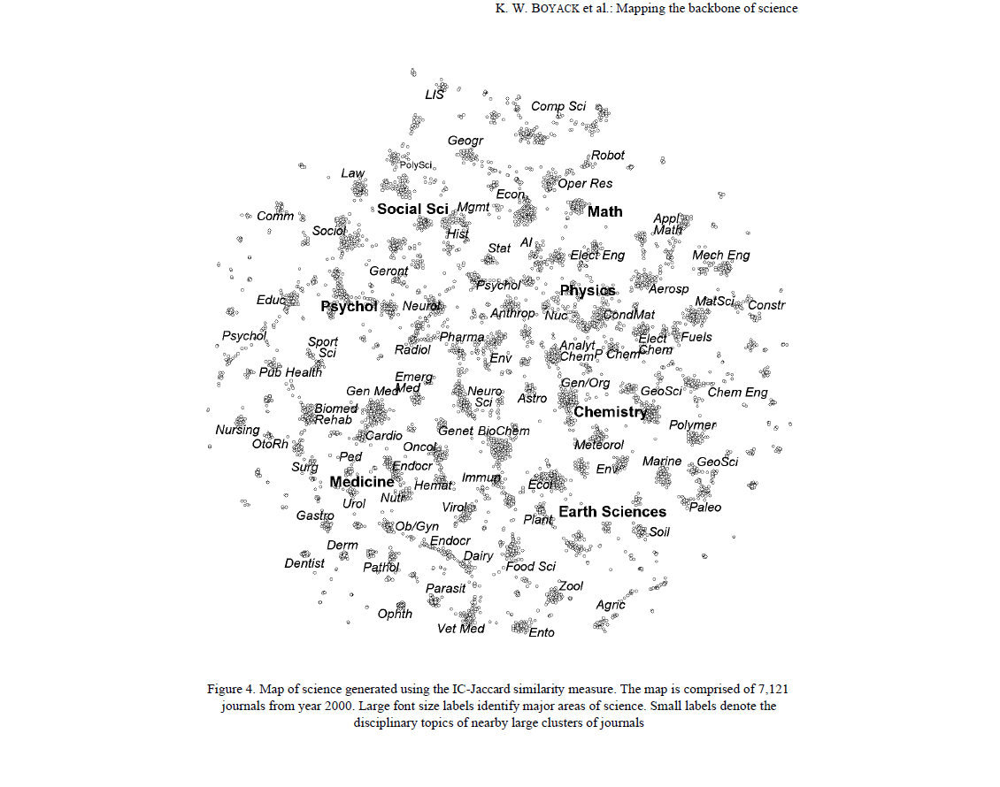
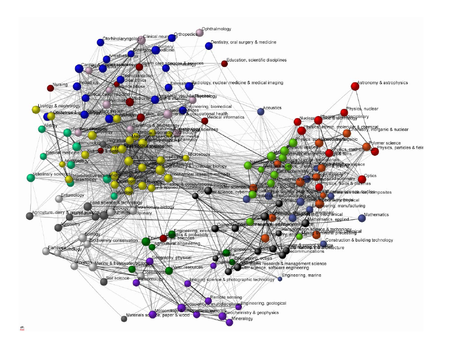
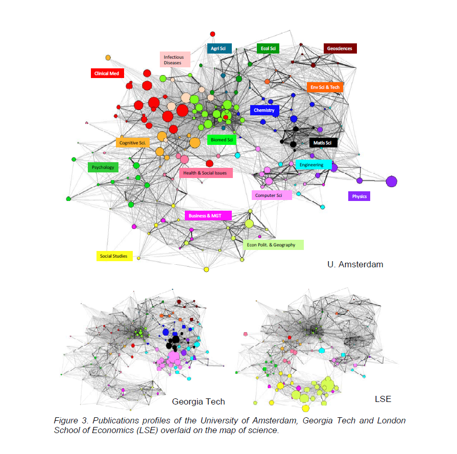

# Goal of this project
This repository provides methods to produce maps of science from open access data.
The end goal is to make it possible and easy to produce these maps.

## Maps of science
Pioneering work on maps of science dates back to the 2000s with the first global atlases produced by [Katy Börner, Kevin Boyack, Richard Klavans](https://link.springer.com/article/10.1007/s11192-005-0255-6), [Loet Leydesdorff and Ismael Rafols](https://asistdl.onlinelibrary.wiley.com/doi/abs/10.1002/asi.20967).

Maps looked like:

These maps were fascinating and could potentially serve to overlay information on them - just like a map of the Earth is useful when you overlay countries, physical features, trade routes... on it.

Ismael Rafols, Alan L. Porter and Loet Leydesdorff have worked in this direction with ["Science overlay maps: A new tool for research policy and library management"](https://doi.org/10.1002/asi.21368), showing how these maps could be used to "help benchmarking, explore collaborations, and track temporal changes, using examples of universities, corporations, funding agencies, and research topics."

For instance, it becomes possible, at a glance, to contrast the publication profiles of three unversities:

## Why re-doing maps of science all over again?
A major issue with the maps of science as described above, is that they relied on private data to be built. ISI, Web of Knowledge, Scopus, Clarivate: all these products and companies were the providers of the data that was used to build the maps.

This means that **as the data was private, it was not allowed to share it so that anyone could reproduce, update, build new things with the maps.**

The reality is that today, there is no free and easy way to access maps of science, even if the groundwork for them has been published more than 10 years ago.

This is the reason for this project. Today, thanks to the [OpenAlex foundation]() and similar initiatives, the necessary data to build these maps has been freed. So let's create maps and make them easy to re-use!

## Are you going to create maps exactly like they were produced before?
Yes and no.

Yes: I'll start by building maps of journals, so pretty much the principle followed by the pionneers.

No: maps of journals were built by measuring the similarity of journals based on citations. This is pretty data intensive, to say the least. But there was no clear alternative. Today, thanks to another great initiative ([ORCID](https://orcid.org/)), we have unique identifiers for a large number of authors. This provides a rich information to evaluate if two journals relate to each other: 2 journals can be said to be be similar if a number of authors published in both. I expect it to be much less data intensive than citation-based approaches. As a consequence, it should lower considerably the complexity of the resources needed to build the maps: I aim to **design methods that allow to create maps by using a regular laptop, not an expensive cloud computing infrastructure**.

## On twitch
This project is live streamed on Twitch every Wednesday for one hour.
3pm (Paris time) / 9am (ET).

-> https://twitch.tv/clementlevallois

-> replays on YT: https://youtu.be/6I-bOIyhrm4

## Data source
The data comes from the [OpenAlex Foundation](https://openalex.org/).

### First project: creating an atlas of journals

✅1. Fetch a list of all articles from all journals in recent years.

-> done! that's 20 million entries in a 65Gb file.

✅2. For each publication, note the journal where it appears, and the authors.

-> done! this produces a 1.2Gb file.

✅3. Process and transform this data to obtain a list of journals, and for each journal, the list of auhthors who published in it.

-> done! this is a 0.9Gb file.

🔨4. Check each pair of journals: if many authors published in both, this means the journals have a degree of similarity. We record this as a "connection" between the 2 journals.

-> there are 2 billion pairs of journal to compare!

🔨5. Keep only the strongest connections / remove the very weak ones.

-> should be pretty easy.

🔨6. Visualize and layout all the journals and their connections in [Gephi](https://gephi.org).

🔨7. Publish the resulting pictures (and files used to generate them) on Github for anyone to reuse.

## License
Code, data and assets created in this project are licensed with CC BY 4.0: free to reuse even for commercial purposes, with attribution.

## How to cite / attribute
If you use any of the assets produced here, citing this repository is vital to the continuation of the project. It takes a minute and makes a real difference:

Levallois, Clement (2023). Designing open maps of science with OpenAlex data. Github, https://github.com/seinecle/MapsOfScience
